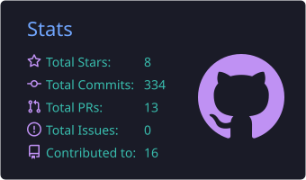
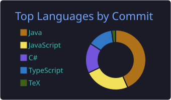

  

  
  
  

## 👨‍💻 Sobre mí

- 🎓 Estudiante de **Ingeniería de Sistemas** en la [Universidad del Cauca](https://www.unicauca.edu.co).
- 🧱 Me interesa la **arquitectura de software**: capas, MVC, microkernel, microservicios, hexagonal y patrones GoF aplicados a proyectos reales.
- 🖥️ Construyo aplicaciones de **escritorio** (.NET + Avalonia, Electron, Tauri) y **web** (Next.js, React, NestJS, Spring Boot).
- 🔐 Me apasiona la **ciberseguridad** y trabajo a diario en **Linux** (Arch / Kali) desde la terminal.
- 🧪 Me gusta que mis proyectos compilen, tengan pruebas y corran en CI.
- 🏆 Programador competitivo: disfruto resolver problemas.

 

## ⭐ Proyectos destacados

### 🎬 [streaming-Sntx](https://github.com/santyxswc/streaming-Sntx) · [ver en vivo ↗](https://streaming-sntx.vercel.app)

Catálogo de **más de 100.000 películas y series** para descubrir títulos por sus tráilers oficiales,
con **búsqueda en lenguaje natural asistida por IA**, listas personales y chat por título.
Tiene app web y cliente de escritorio que consumen la misma API.

  
  
  
  
  
  
  

<table>
  <tr>
    <td width="50%" valign="top">
      <h3>💊 <a href="https://github.com/santyxswc/FarmaciaApp">FarmaciaApp</a></h3>
      
      
Gestión de una farmacia: ventas con facturación, inventario, clientes, proveedores, promociones y turnos de empleados. Multiplataforma.

      
      
      
      
    </td>
    <td width="50%" valign="top">
      <h3>🃏 <a href="https://github.com/santyxswc/BlackJack-CS">BlackJack</a></h3>
      
      
Blackjack de escritorio contra la banca, con cuentas de jugador que guardan saldo y estadísticas entre partidas. Windows, Linux y macOS.

      
      
      
    </td>
  </tr>
  <tr>
    <td width="50%" valign="top">
      <h3>🏥 <a href="https://github.com/santyxswc/CuadroDeTurnos">TurnoCare</a></h3>
      
Aplicación de escritorio para que un equipo de enfermería maneje su cuadro de turnos, marcaciones, horas diurnas/nocturnas, recargos, vacaciones y chat del equipo. Motor de reglas en TypeScript puro con pruebas.

      
      
      
      
    </td>
    <td width="50%" valign="top">
      <h3>📝 <a href="https://github.com/santyxswc/Banco_preguntas-ISoftII">Banco de Preguntas Saber Pro</a></h3>
      
Proyecto en equipo: gestión, validación estructural y revisión por pares de preguntas tipo Saber Pro. Evoluciona de monolito en capas (MVC) a microservicios con eventos y arquitectura hexagonal.

      
      
      
      
    </td>
  </tr>
</table>

Otros: [Lab_ing_softwareII](https://github.com/santyxswc/Lab_ing_softwareII) (microkernel + tuberías y filtros, API REST con Spring Boot) ·
[ArquitecturaComputacional](https://github.com/santyxswc/ArquitecturaComputacional) (control de acceso y ambiental) ·
[almacen-c](https://github.com/santyxswc/almacen-c) (POO en C++)

## 🛠️ Tecnologías

**Lenguajes**

  

**Frameworks, datos y herramientas**

  
   
  

**Sistemas y seguridad**

  
  
  
  

## 📊 Actividad en GitHub

  
  

  

  <picture>
    <source media="(prefers-color-scheme: dark)" srcset="https://raw.githubusercontent.com/santyxswc/santyxswc/output/github-snake-dark.svg"/>
    <source media="(prefers-color-scheme: light)" srcset="https://raw.githubusercontent.com/santyxswc/santyxswc/output/github-snake.svg"/>
    
  </picture>

